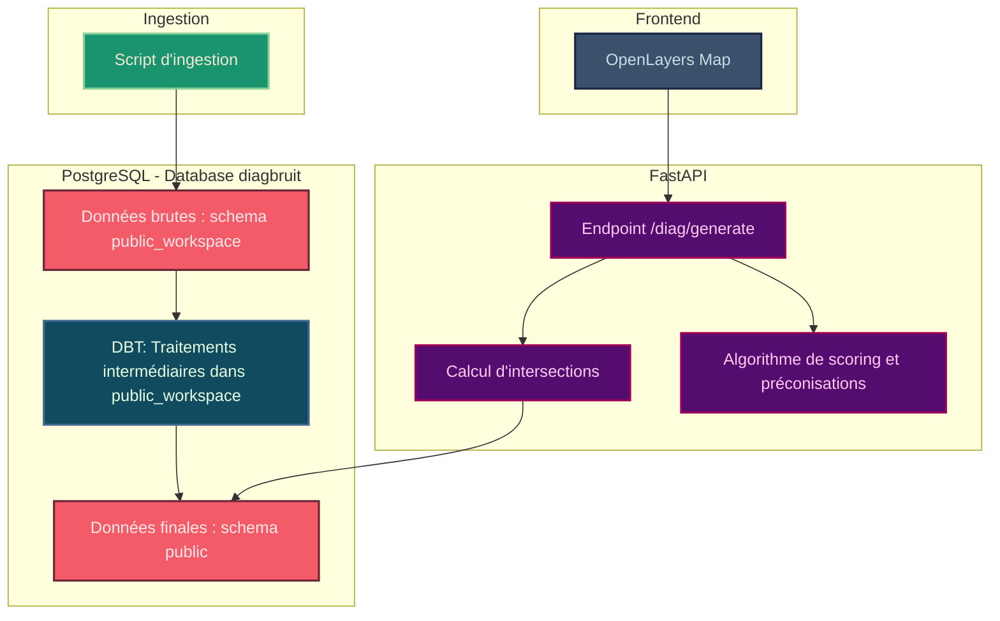

# 🙉 diagBruit 🙉

Remettre le bruit comme un critère important dans la construction des projets d’aménagement (particulier, promoteur, Opération d’intérêt Métropolitain ou National) pour que les gens bénéficient de cadres de vie apaisés, en intégrant les impacts sonores comme facteur clé dans les décisions d’aménagement. Actuellement ce n’est pas une priorité.

Le reste du README est en anglais, dans un souci de cohérence et d'accessibilité.

## 🧰 Prerequisites

- Python 3.8+
- GEOS library for spatial data processing:

  ```bash
  # On Ubuntu/Debian
  sudo apt-get install libgeos-dev

  # On macOS
  brew install geos

  # On CentOS/RHEL
  sudo yum install geos-devel
  ```

## 🐘 Start the PostgreSQL Database with PostGIS

The project uses PostgreSQL with PostGIS extension for spatial data. Launch it using Docker Compose:

```bash
docker compose up -d
```

This will start a PostgreSQL database with the PostGIS extension on port 5433.

## ⚡ Quick Setup

For a quick setup of all virtual environments:

```bash
./setup-dev.sh
```

This will create and configure all virtual environments for the different components of the project. You can then activate the environment you need to work with.

## 🥣 Data ingestion

### Launch dedicated Virtual Environment

```bash
source ingestion-venv/bin/activate
```

### Launch seed raw data

```bash
cd ingestion
./launch-ingestion.sh
```

## 🧪 DBT

### Launch dedicated Virtual Environment

```bash
source dbt-venv/bin/activate
```

### Configure dbt Profile

```bash
./setup-dbt.sh
```

Optional : edit `~/.dbt/profiles.yml` with your database credentials if you do not use the docker-compose db.

### From dbt folder

```bash
cd dbt
```

### Verify Configuration

```bash
dbt debug
```

### Run Models

```bash
dbt run
```

## 🚀 FastApi

### Launch dedicated Virtual Environment

```bash
source fastapi-venv/bin/activate
```

### From fastapi folder

```bash
cd fastapi
```

### Configure Environment Variables

```bash
cp .env.example .env
```

### Run the Application

```bash
uvicorn app.main:app --reload
```

The API will be available at http://127.0.0.1:8000

### API Documentation

- Swagger UI: http://127.0.0.1:8000/docs
- ReDoc: http://127.0.0.1:8000/redoc

## 🗺️ Frontend

### Install Dependencies

```
cd frontend
cp .env.example .env
yarn
```

### Start the Application

```
yarn start
```

The frontend will be available at http://localhost:3000

## ☁️ Deploying on Scalingo

Add scalingo remotes

```
git remote add scalingo-fastapi git@ssh.osc-fr1.scalingo.com:diag-bruit-back.git
git remote add scalingo-frontend git@ssh.osc-fr1.scalingo.com:diag-bruit-front.git
```

Deploy FastAPI last commit

```
git subtree push --prefix fastapi scalingo-fastapi main
```

Deploy Frontend last commit

```
git subtree push --prefix frontend scalingo-frontend main
```

## 🧬 Macro architecture



## 🗂️ Project Structure

```
diagbruit/
│
├── fastapi/
│   ├── app/
│   │   ├── main.py
│   │   ├── database.py
│   │   ├── models/
│   │   ├── routes/
│   │   ├── schemas/
│   │   └── utils/
│   │
│   ├── .env.example
│   ├── requirements.txt
│
├── dbt/
│   ├── models/
│   ├── macros/
│   ├── tests/
│   ├── dbt_project.yml
│   ├── profiles.yml.example
│   └── requirements.txt
│
├── ingestion/
│   ├── inputs/
│   ├── .env.example
│   ├── ingest_shapefiles.py
│   └── requirements.txt
|
├── frontend/
│   ├── .env.example
│   ├── package.json
│   ├── public/
│   ├── src/
│   └── tsconfig.json
│
├── setup-dev.sh
├── setup-dbt.sh
└── docker-compose.yml
```
